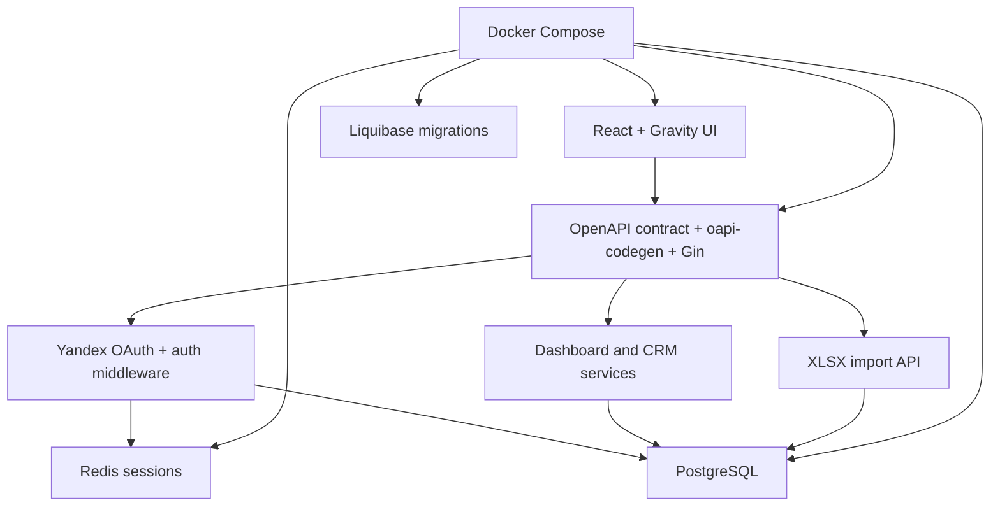

# MerchCRM - fullstack/backend/infra case study

MerchCRM - внутреннее веб-приложение для учёта корпоративного мерча: поступлений, перемещений между офисами, выдачи сотрудникам и обработки данных из XLSX-файлов.

Исходный код находится в приватном репозитории. Этот case study описывает назначение системы, архитектуру и мой личный вклад без публикации исходников, секретов, внутренних URL и бизнес-данных.

## Задача проекта

До MerchCRM учёт строился вокруг разрозненных Excel-файлов и ручных коммуникаций. Из-за этого было сложно:

- получить актуальное состояние остатков и выдач;
- сопоставить позиции, сотрудников, офисы и отправки;
- искать записи и применять единые фильтры;
- контролировать доступ сотрудников разных офисов;
- отслеживать результат обработки загруженных файлов.

Цель MVP - собрать эти процессы в единой CRM с формализованным API, серверным разграничением доступа и воспроизводимым окружением запуска.

## Моя роль

Работал как fullstack-разработчик и отвечал за связный пользовательский сценарий от API и серверной бизнес-логики до React-интерфейса, контейнерного запуска и CI.

Мой вклад включал:

- Yandex OAuth, Redis-сессии и ролевое middleware;
- разработку и корректировку OpenAPI-контракта;
- серверную CRM-таблицу, поиск, фильтры и пагинацию;
- серверную проверку офисного контекста;
- сводку ожидающего выдачи мерча по командам;
- изменение статуса и комментария с проверкой доступа;
- всё клиентское приложение на React;
- клиентский сценарий асинхронного импорта XLSX;
- доработку Docker Compose и настройку SourceCraft CI.

## Возможности MVP

- вход через Yandex ID;
- роли администратора офиса и суперпользователя;
- ограничение данных по закреплённому офису;
- CRM-таблица с поиском, фильтрами и пагинацией;
- карточки по статусам и сводные показатели;
- просмотр детальной информации о позиции и отправке;
- изменение статуса выдачи и комментария;
- загрузка XLSX с параметрами отправки;
- журнал асинхронной обработки файлов;
- автоматическое обновление CRM после завершения импорта.

## Архитектура

Для MVP выбран модульный монолит: он сохраняет простоту локальной разработки и транзакций, но разделяет HTTP-слой, предметные сервисы и доступ к данным.



OpenAPI-спецификация выступает источником истины для HTTP-контракта. `oapi-codegen` генерирует строгий Go-интерфейс и транспортные DTO, а реализация обработчиков остаётся в предметных модулях.

## Backend

### Аутентификация и сессии

Реализовал полный Yandex OAuth flow:

1. Backend генерирует криптографически случайный `state`.
2. `state` сохраняется в короткоживущей cookie.
3. После callback сервер проверяет `state` и обменивает authorization code на access token.
4. По токену запрашивается профиль Yandex ID.
5. Пользователь сопоставляется с предварительно созданной учётной записью в PostgreSQL.
6. В Redis создаётся непрозрачная сессия с TTL.
7. Идентификатор сессии передаётся через `HttpOnly` cookie.

Сессии вынесены из памяти приложения в Redis, поэтому их можно централизованно продлевать и отзывать. TTL обновляется не на каждом запросе, а после заданного интервала, что уменьшает количество операций записи в Redis.

### Авторизация и офисный контекст

Доступ проверяется на двух уровнях:

- middleware определяет класс маршрута и проверяет наличие сессии и роль;
- предметный сервис применяет object-level правило к конкретной записи.

Администратор всегда работает в контексте закреплённого офиса. Суперпользователь может выбирать офис и просматривать связанные перемещения. Ограничение выполняется на сервере и не зависит от скрытия элементов интерфейса.

### CRM-таблица и фильтрация

Реализовал серверную выдачу CRM-таблицы запросом к связанным таблицам мерча, категорий, сотрудников, отправок и офисов. Обязательные и необязательные связи учитываются через `JOIN` и `LEFT JOIN`, поэтому строка интерфейса формируется без серии дополнительных запросов к БД.

Фильтрация выполняется до пагинации. Поддерживаются:

- текстовый поиск по названию мерча, логину и имени сотрудника;
- статус и категория;
- команда сотрудника;
- наличие отправки;
- офис отправления и назначения;
- `limit` и `offset`.

Сначала вычисляется общее число подходящих записей, затем возвращается выбранная страница. Это делает результат пагинации корректным при активных фильтрах и не заставляет клиент загружать весь набор данных.

Также реализовал:

- сводку ожидающего выдачи мерча по командам;
- учёт офисного контекста в серверных запросах;
- `PATCH` статуса и комментария с проверкой доступа к записи.

## Frontend

Полностью реализовал клиентское приложение на React:

- экран входа через Yandex ID;
- `AuthProvider` с состояниями проверки сессии, успешной авторизации и ошибки;
- CRM-таблицу, карточки, сводки и панель деталей;
- поиск и набор комбинируемых фильтров;
- отображение активных условий в виде удаляемых тегов;
- переключение офиса для суперпользователя;
- изменение статуса выдачи с обновлением таблицы и агрегатов;
- страницу импорта и журнал обработки файлов.

Для XLSX-импорта клиент отправляет файл и параметры перемещения, обрабатывает ответ `202 Accepted` и периодически запрашивает состояние операции. После завершения интерфейс прекращает polling и обновляет CRM. Пользователь не блокируется на время длительной обработки и видит статус каждой загрузки.

## Инфраструктура

Доработал Docker Compose для согласованного запуска пяти сервисов:

- PostgreSQL;
- Redis;
- Liquibase;
- backend;
- frontend.

Порядок запуска зафиксирован через healthchecks и зависимости:

```text
PostgreSQL healthy ─> Liquibase completed ─┐
                                           ├─> backend healthy ─> frontend
Redis healthy ─────────────────────────────┘
```

Backend не стартует до готовности PostgreSQL и Redis и успешного применения миграций. Это устраняет нестабильный запуск, при котором приложение поднимается раньше зависимостей или актуальной схемы БД.

## CI и проверки

Настроил workflow `pr-checks` в SourceCraft для pull request в `main`.

Backend:

- `gofmt -l .`;
- `go test ./...`;
- `go vet ./...`;
- `go build ./cmd/app`.

Frontend:

- 5 тестовых наборов, 21 тест;
- production build.

Infrastructure:

- offline-валидация Liquibase master changelog;
- `docker compose config --quiet`;
- ручная проверка healthchecks, зависимостей запуска и основных пользовательских сценариев.

Проверки форматирования, тестов, статического анализа, сборки, миграций и Compose-конфигурации запускаются до слияния изменений и снижают вероятность интеграционных регрессий.

## Командные компоненты

Проект выполнялся командой. Чтобы не присваивать общий результат, отдельно фиксирую компоненты, которые использовал и интегрировал, но не реализовывал единолично:

- реляционная модель и полный набор Liquibase-миграций;
- инфраструктура генерации Go-интерфейса через `oapi-codegen`;
- backend-нормализация XLSX;
- часть серверных агрегатов дашборда.

## Технологии

- Go, Gin, GORM
- React, Gravity UI
- PostgreSQL, Redis
- OpenAPI, oapi-codegen
- Yandex OAuth
- Liquibase
- Docker Compose
- SourceCraft CI

## Результат

Получился связный MVP: пользователь входит через Yandex ID, работает только с доступным ему офисным контекстом, ищет и фильтрует позиции, просматривает сводки и детали, меняет состояние выдачи и запускает асинхронный импорт XLSX. Серверная, клиентская и инфраструктурная части объединены формализованным API и воспроизводимым pipeline запуска.

## Что не опубликовано

- исходный код приватного проекта;
- production/internal URL;
- секреты, токены и OAuth credentials;
- реальные пользовательские и бизнес-данные;
- внутренние детали компонентов, реализованных другими участниками.

## Кратко для резюме

Разработал fullstack-функциональность внутренней MerchCRM: Yandex OAuth и Redis-сессии, role/office-scoped авторизацию, OpenAPI-контракт, серверную CRM-таблицу с фильтрацией и пагинацией, React-интерфейс и асинхронный XLSX workflow. Доработал Docker Compose и настроил SourceCraft CI для проверок Go-кода, frontend, Liquibase и инфраструктурной конфигурации.
